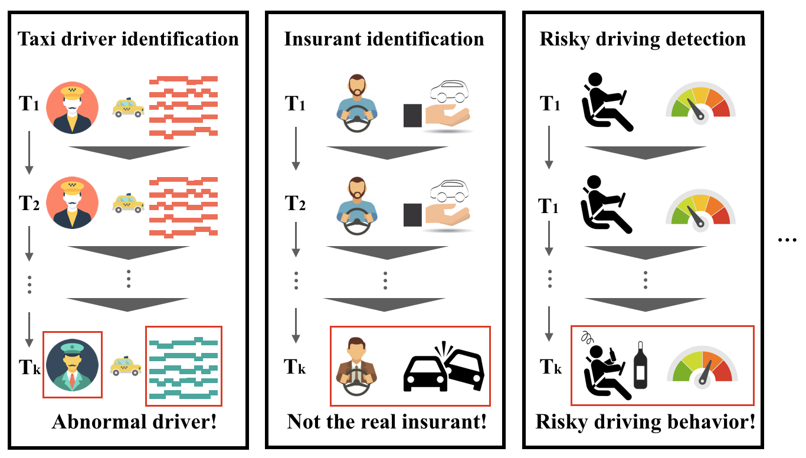
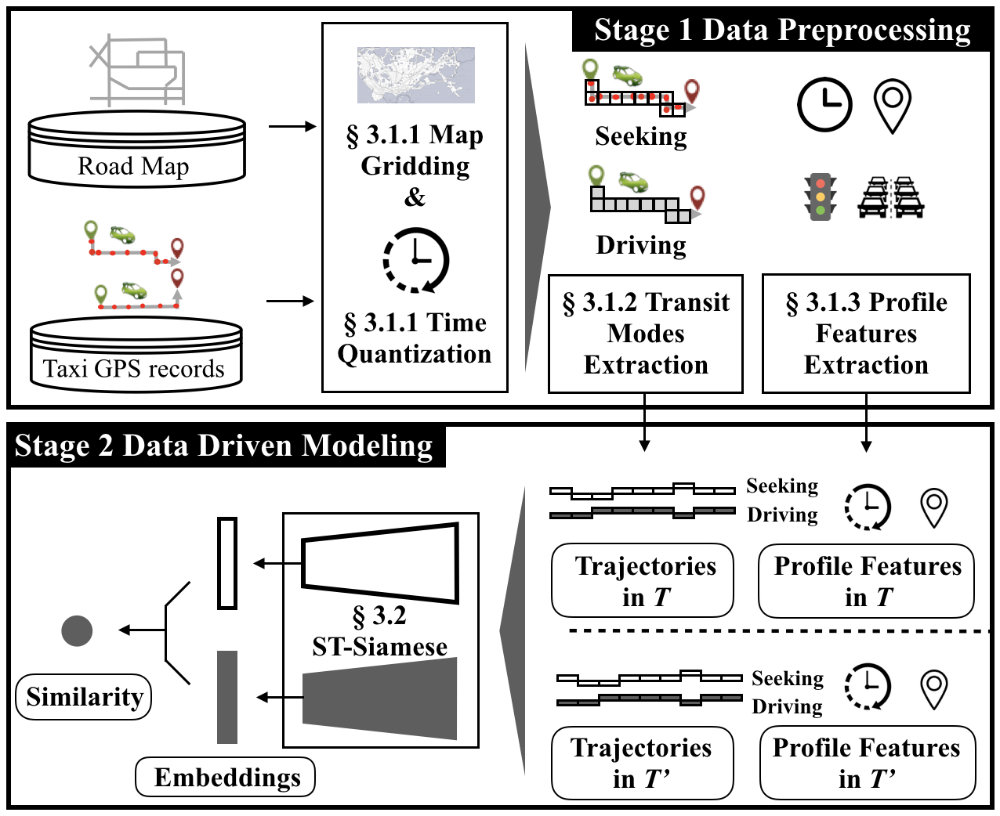

# ST-SiameseNet
<p align="center">


</p>

## About
Source code of the paper: ST-SiameseNet: Spatio-Temporal Siamese Networks for Human Mobility Signature Identification
## Requirements
* Python >= 3.6
* `tensorflow >= 2.0.0`
* `keras >= 2.0.0`

## Usage
* Installation
  * Clone this repo:
    ```bash
    git clone https://github.com/huiminren/ST-SiameseNet.git
    cd ST-SiameseNet
    ```
  * Install Keras 2.0
    * For pip users, please type the command `pip install -r requirements.txt`.
  
* Dataset
  * We provide 500 drivers as sample data. If you need full dataset, please feel free to contact us.

* Running
  * `python main.py`
